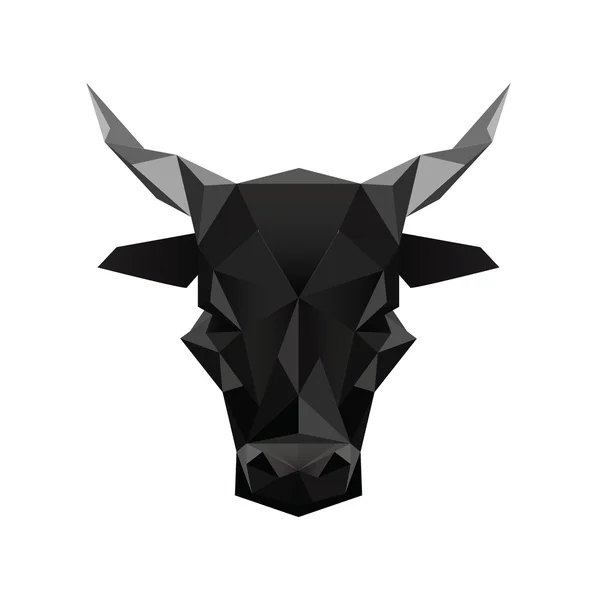

<div id="top"></div>


<!-- PROJECT SHIELDS -->
[![Contributors][contributors-shield]][contributors-url]
[![Forks][forks-shield]][forks-url]
[![Stargazers][stars-shield]][stars-url]
[![Issues][issues-shield]][issues-url]
[![MIT License][license-shield]][license-url]


<!-- PROJECT LOGO -->
<br />
<div align="center">
  <a href="https://github.com/zhenxinglu/NiuBangBang">
    
  </a>

<h3 align="center">NiuBangBang</h3>

  <p align="center">
    NiuBangBang(牛棒棒) is a tool for rating the funds in China stock market. 
    <br />
    <a href="https://github.com/zhenxinglu/NiuBangBang"><strong>Explore the docs »</strong></a>
    <br />
    <br />
    <a href="https://github.com/zhenxinglu/NiuBangBang">View Demo</a>
    ·
    <a href="https://github.com/zhenxinglu/NiuBangBang/issues">Report Bug</a>
    ·
    <a href="https://github.com/zhenxinglu/NiuBangBang/issues">Request Feature</a>
  </p>
</div>


<!-- TABLE OF CONTENTS -->
<details>
  <summary>Table of Contents</summary>
  <ol>
    <li>
      <a href="#about-the-project">About The Project</a>
      <ul>
        <li><a href="#built-with">Built With</a></li>
      </ul>
    </li>
    <li>
      <a href="#getting-started">Getting Started</a>
      <ul>
        <li><a href="#prerequisites">Prerequisites</a></li>
        <li><a href="#build-the-installer">Build the installer</a></li>
      </ul>
    </li>
    <li><a href="#usage">Usage</a></li>
    <li><a href="#roadmap">Roadmap</a></li>
    <li><a href="#contributing">Contributing</a></li>
    <li><a href="#license">License</a></li>
    <li><a href="#contact">Contact</a></li>
  </ol>
</details>


<!-- ABOUT THE PROJECT -->
## About The Project

[![Product Name Screen Shot][product-screenshot]](https://gluonhq.com/products/javafx/)

There are over 8000 funds in the China stock market. As a green hand of personal finance, I do not know
which funds to buy, so develop this tool to rate the funds for me.


<p align="right">(<a href="#top">back to top</a>)</p>


### Built With

NiuBangBnag(牛棒棒) is a JavaFX application. It crawls the https://fund.eastmoney.com/ to the raw
fund data.

* [JavaFX](https://openjfx.io/)
* [天天基金](https://fund.eastmoney.com/)

<p align="right">(<a href="#top">back to top</a>)</p>


<!-- GETTING STARTED -->
## Getting Started

### Prerequisites
* install [JavaFX 16+ modules](https://gluonhq.com/products/javafx) and set environment variable PATH_TO_FX_MODS.
  ```sh
  PATH_TO_FX_MODS=/path/to/JavaFX/modules
  ```
* install Maven
* install JDK 16+

### Build the installer
1. cd <project_home_dir>
2. mvn package

<p align="right">(<a href="#top">back to top</a>)</p>

<!-- USAGE EXAMPLES -->
## Usage
After launching the NiuBangBang, the user can set the parameters for rating the funds.

<p align="right">(<a href="#top">back to top</a>)</p>


<!-- CONTRIBUTING -->
## Contributing

Contributions are what make the open source community such an amazing place to learn, inspire, and create. Any contributions you make are **greatly appreciated**.

If you have a suggestion that would make this better, please fork the repo and create a pull request. You can also simply open an issue with the tag "enhancement".
Don't forget to give the project a star! Thanks again!

1. Fork the Project
2. Create your Feature Branch (`git checkout -b feature/AmazingFeature`)
3. Commit your Changes (`git commit -m 'Add some AmazingFeature'`)
4. Push to the Branch (`git push origin feature/AmazingFeature`)
5. Open a Pull Request

<p align="right">(<a href="#top">back to top</a>)</p>

<!-- LICENSE -->
## License

Distributed under the MIT License. See `LICENSE.txt` for more information.

<p align="right">(<a href="#top">back to top</a>)</p>


<!-- CONTACT -->
## Contact

Zhenxing Lu : zhenxinglu@gmail.com

Project Link: https://github.com/zhenxinglu/NiuBangBang

<p align="right">(<a href="#top">back to top</a>)</p>


<!-- MARKDOWN LINKS & IMAGES -->
<!-- https://www.markdownguide.org/basic-syntax/#reference-style-links -->
[contributors-shield]: https://img.shields.io/github/contributors/othneildrew/Best-README-Template.svg?style=for-the-badge
[contributors-url]: https://github.com/zhenxinglu/NiuBangBang/graphs/contributors
[forks-shield]: https://img.shields.io/github/forks/othneildrew/Best-README-Template.svg?style=for-the-badge
[forks-url]: https://github.com/zhenxinglu/NiuBangBang/network/members
[stars-shield]: https://img.shields.io/github/stars/othneildrew/Best-README-Template.svg?style=for-the-badge
[stars-url]: https://github.com/zhenxinglu/NiuBangBang/stargazers
[issues-shield]: https://img.shields.io/github/issues/othneildrew/Best-README-Template.svg?style=for-the-badge
[issues-url]: https://github.com/zhenxinglu/NiuBangBang/issues
[license-shield]: https://img.shields.io/github/license/othneildrew/Best-README-Template.svg?style=for-the-badge
[license-url]: https://github.com/zhenxinglu/NiuBangBang/blob/master/LICENSE.txt
[product-screenshot]: images/niuBangBang_screenshot.png
